<div align="center">

# 👋 Hi, I'm Dương Nhật Anh

### `Software Developer` · `Full-stack Enthusiast` · `Vietnam 🇻🇳`


<br/>

<a href="mailto:anhkhung123@gmail.com">
  
</a>
<a href="https://www.facebook.com/katorivn">
  
</a>
<a href="https://linkedin.com/in/duy-nhat-anh">
  
</a>
<a href="https://katorivn.com">
  
</a>

</div>

<br/>

## 🧑‍💻 About Me

```ts
const katorivn = {
    name: "Dương Nhật Anh",
    location: "Vietnam 🇻🇳",

    focus: [
        "Full-stack Development",
        "Backend Systems",
        "Mobile Development"
    ],

    currentlyLearning: [
        "C#",
        ".NET",
        "Dart",
        "Flutter"
    ],

    motto: "Code. Learn. Build. Repeat."
};
```

<br/>

## 🛠️ Tech Stack

<div align="center">

### Languages


### Frontend


### Backend


### Database


### Tools


</div>

<br/>

## 🚀 Featured Projects

<table>
<tr>
<td width="50%" valign="top">

### 📊 EMC Management

Task & team management platform focused on project collaboration and productivity.

**Stack**

`Next.js` `MongoDB` `Pusher`

<br/>

<a href="https://github.com/katorivn699/EMCDashboard">

</a>

</td>

<td width="50%" valign="top">

### 🚗 Drive Learning App

Mobile learning application built for studying and practicing driving knowledge.

**Stack**

`Dart` `Flutter` `Android Studio`

<br/>

<a href="https://github.com/katorivn699/beludrive">

</a>

</td>
</tr>
</table>

<br/>

## 📈 GitHub Overview

<div align="center">



<br/><br/>




</div>

<br/>

<details>
<summary><b>📊 More GitHub Stats</b></summary>

<br/>

<div align="center">




</div>

</details>

<br/>

## 🐍 Contribution Graph

<div align="center">

<picture>
  <source
    media="(prefers-color-scheme: dark)"
    srcset="https://raw.githubusercontent.com/katorivn699/katorivn699/output/github-contribution-grid-snake-dark.svg"
  />
  <source
    media="(prefers-color-scheme: light)"
    srcset="https://raw.githubusercontent.com/katorivn699/katorivn699/output/github-contribution-grid-snake.svg"
  />
  
</picture>

</div>

<br/>

## ☕ Support

<div align="center">

If you like my projects, consider supporting me.

<br/><br/>

<a href="https://ko-fi.com/katorivn699">
  
</a>

<br/><br/>


<br/><br/>

### Thanks for stopping by 👋

<sub>Building cool things, one commit at a time.</sub>

</div>
